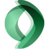

# QweesCore Icons

Официальный пакет иконок QweesCore для Visual Studio Code - современный и элегантный набор иконок для улучшения визуального опыта разработки.



## 🚀 Возможности

### 📁 Иконки папок
- **Специальные папки**: `src`, `components`, `utils`, `api`, `assets`, `public`, `styles`, `scripts`, `tests`, `docs`, `config`, `build`, `dist`
- **Git папки**: `.git`, `.github` с уникальными иконками
- **Node.js**: `node_modules` с фирменными иконками
- **Базы данных**: `sql` папки
- **Ресурсы**: `lib`, `resources`, `examples`, `vendor`

### 📄 Иконки файлов

#### Языки программирования
- **Web**: JavaScript, TypeScript, HTML, CSS, SCSS, SASS, LESS
- **Backend**: Python, Java, C/C++, PHP, Ruby, Go, Rust
- **Базы данных**: SQL
- **Скрипты**: Shell, Batch, PowerShell

#### Фреймворки
- **Frontend**: React, Vue, Angular, Svelte, Astro, Next.js, Nuxt
- **Backend**: Laravel, Django, Rails, Express, Spring
- **Qwees**: Специальные иконки для Qwees фреймворка

#### Конфигурационные файлы
- **Package Managers**: `package.json`, `yarn.lock`, `pnpm-lock.yaml`
- **Build Tools**: `webpack.config.js`, `vite.config.js`
- **Linters**: `.eslintrc`, `.prettierrc`
- **Environment**: `.env`, `.env.local`, `.env.production`
- **TypeScript**: `tsconfig.json`, `jsconfig.json`

#### Документация
- **Markdown**: `.md` файлы, README, CHANGELOG
- **License**: `LICENSE`, `LICENSE.md`
- **Git**: `.gitignore`, `.gitattributes`

#### Медиа файлы
- **Изображения**: PNG, JPG, JPEG, GIF, SVG, ICO
- **Аудио**: MP3
- **Видео**: MP4, AVI, MOV
- **Документы**: PDF, Word, Excel, PowerPoint, CSV
- **Архивы**: ZIP, RAR, TAR, GZ

#### DevOps
- **Docker**: `Dockerfile`, `docker-compose.yml`
- **CI/CD**: GitHub Actions
- **Build**: CMake, Makefile

## 📦 Установка

### Через VS Code Marketplace
1. Откройте VS Code
2. Перейдите в раздел Extensions (Ctrl+Shift+X)
3. Поищите "QweesCore Icons"
4. Нажмите Install

### Ручная установка
1. Скачайте `.vsix` файл из Releases
2. Откройте VS Code
3. Перейдите в Extensions (Ctrl+Shift+X)
4. Нажмите на иконку с тремя точками (...) вверху
5. Выберите "Install from VSIX..."
6. Выберите скачанный файл

## ⚙️ Активация

После установки:
1. Откройте Command Palette (Ctrl+Shift+P или Cmd+Shift+P)
2. Введите "Preferences: Color Theme"
3. Выберите "QweesCore Icons"

Или через настройки:
1. Откройте Settings (Ctrl+, или Cmd+,)
2. Поищите "File Icon Theme"
3. Выберите "QweesCore Icons"

## 🛠️ Разработка

### Структура проекта
```
qweesicon/
├── icons/
│   ├── files/          # Иконки файлов
│   │   ├── lang/       # Языки программирования
│   │   ├── framework/  # Фреймворки
│   │   ├── config/     # Конфигурационные файлы
│   │   ├── doc/        # Документы
│   │   ├── media/      # Медиа файлы
│   │   └── ...
│   ├── folders/        # Иконки папок
│   │   ├── tools/      # Инструменты
│   │   ├── resources/  # Ресурсы
│   │   ├── git/        # Git
│   │   └── ...
│   └── logo/           # Логотип
├── script/
│   └── setting.json     # Конфигурация иконок
├── extension.js        # Основной файл расширения
├── package.json        # Пакет
└── update_icons.sh     # Скрипт обновления иконок
```

### Скрипты
- `npm run update-icons` - Обновление иконок из папки `new`
- `npm run create-package` - Создание `.vsix` пакета

### Добавление новых иконок

1. Добавьте SVG файл в соответствующую папку в `icons/`
2. Обновите `script/setting.json`:
   ```json
   {
     "iconDefinitions": {
       "_my_icon": {
         "iconPath": "../icons/files/my_category/my_icon.svg"
       }
     },
     "fileExtensions": {
       "myext": "_my_icon"
     }
   }
   ```

3. Запустите `npm run update-icons` для применения изменений

## 🔄 Обновление иконок

Для массовой замены иконок:
1. Поместите новые SVG файлы в папку `new`
2. Запустите скрипт:
   ```bash
   ./update_icons.sh
   ```
3. Скрипт автоматически найдет и заменит иконки с точными совпадениями имен

## 📋 Поддерживаемые файлы

### Расширения файлов
- `js`, `jsx`, `ts`, `tsx` - JavaScript/TypeScript
- `py` - Python
- `java` - Java
- `cpp`, `c`, `h` - C/C++
- `php` - PHP
- `rb` - Ruby
- `go` - Go
- `rs` - Rust
- `sql` - SQL
- `sh`, `bat`, `ps1` - Скрипты
- `vue`, `svelte`, `astro` - Frontend фреймворки
- И многие другие...

### Специальные файлы
- `package.json`, `yarn.lock`, `pnpm-lock.yaml`
- `README.md`, `CHANGELOG.md`, `LICENSE`
- `.gitignore`, `.env`, `Dockerfile`
- `tsconfig.json`, `webpack.config.js`, `vite.config.js`

### Имена папок
- `src`, `components`, `utils`, `api`, `assets`
- `tests`, `docs`, `config`, `build`, `dist`
- `node_modules`, `.git`, `.github`
- И многие другие...

## 🤝 Вклад в проект

Мы рады вкладу в проект! Чтобы добавить новые иконки или улучшить существующие:

1. Fork проекта
2. Создайте ветку для вашей функции
3. Добавьте SVG иконки в соответствующие папки
4. Обновите `script/setting.json`
5. Создайте Pull Request

### Требования к иконкам
- Формат: SVG
- Размер: 16x16px (или масштабируемый)
- Стиль: Минималистичный, современный
- Цвета: Совместимые с темной и светлой темами

## 📄 Лицензия

Этот проект распространяется под лицензией MIT. Подробности в файле [LICENSE](LICENSE).

## 🐛 Обратная связь

Нашли баг или есть предложение?
- Создайте Issue на GitHub
- Напишите нам на [qweescore@example.com](mailto:qweescore@example.com)

## 🔗 Ссылки

- [VS Code Marketplace](https://marketplace.visualstudio.com/items?itemName=qweescore.qweesicon)
- [GitHub Repository](https://github.com/qweescore/qweesicon)
- [QweesCore Website](https://qweescore.com)

---

**QweesCore Icons** - Сделайте ваш VS Code красивее! 🎨